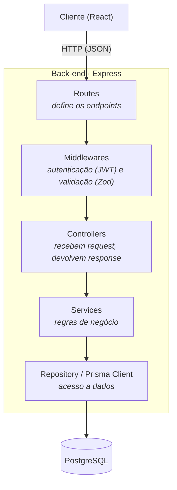
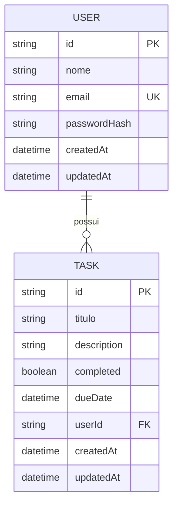
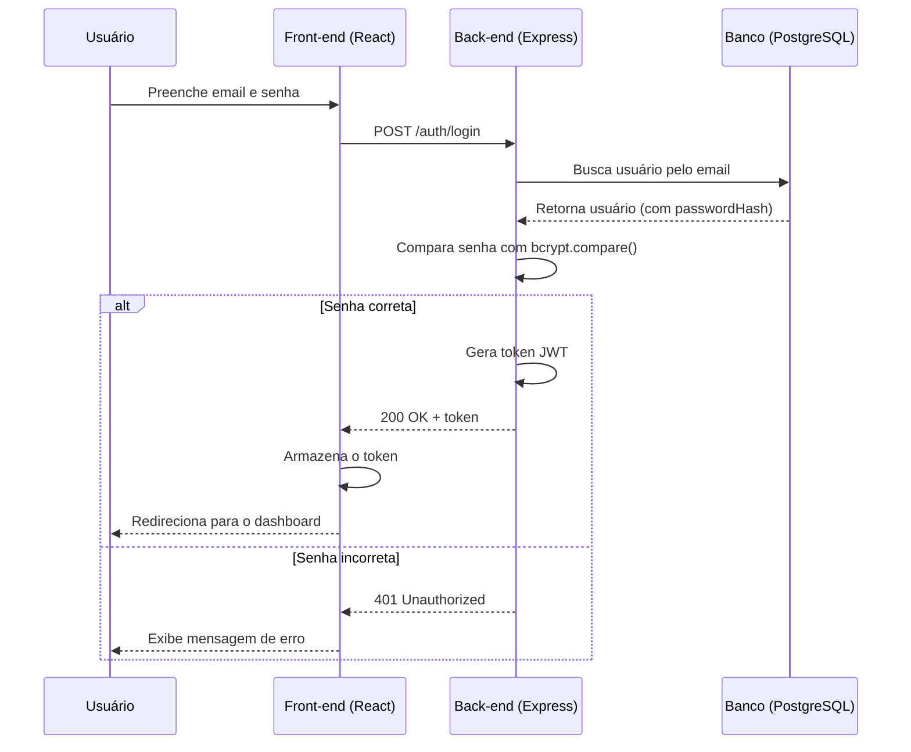

# 📝 Todo List Full-Stack

Aplicação de gerenciamento de tarefas com autenticação de usuários, construída como projeto de estudo aprofundado em back-end, com foco em **Clean Code**, **SOLID** e **Programação Orientada a Objetos**.

> 🚧 Projeto em desenvolvimento ativo. Este README é atualizado conforme novas partes são construídas.

---

## 📚 Índice

- [Sobre o projeto](#-sobre-o-projeto)
- [Stack utilizada](#-stack-utilizada)
- [Arquitetura](#-arquitetura)
- [Modelagem do banco de dados](#-modelagem-do-banco-de-dados)
- [Fluxo de autenticação](#-fluxo-de-autenticação)
- [Como rodar o projeto localmente](#-como-rodar-o-projeto-localmente)
- [Estrutura de pastas](#-estrutura-de-pastas)
- [Roadmap](#-roadmap)
- [Autor](#-autor)

---

## 📖 Sobre o projeto

Uma lista de tarefas (to-do list) onde cada usuário se cadastra, faz login, e gerencia suas próprias tarefas — com título, descrição, prazo e status de conclusão.

O objetivo principal deste projeto **não é só a funcionalidade em si**, mas o processo de construí-la seguindo boas práticas de arquitetura de back-end: separação de responsabilidades (controllers, services, repositories), tipagem forte com TypeScript, autenticação segura com hash de senha e JWT, e modelagem de dados relacional.

---

## 🛠 Stack utilizada

**Back-end**
- [Node.js](https://nodejs.org/) — ambiente de execução
- [Express 5](https://expressjs.com/) — framework do servidor HTTP
- [TypeScript](https://www.typescriptlang.org/) (ESM/`nodenext`) — tipagem estática
- [Prisma 6](https://www.prisma.io/) — ORM (mapeamento objeto-relacional)
- [PostgreSQL](https://www.postgresql.org/) — banco de dados relacional
- [Docker](https://www.docker.com/) — containerização do banco em ambiente local
- [bcrypt](https://www.npmjs.com/package/bcrypt) — hash de senhas
- [jsonwebtoken](https://www.npmjs.com/package/jsonwebtoken) — autenticação via JWT
- [Zod](https://zod.dev/) — validação de dados de entrada
- [Jest](https://jestjs.io/) + [Supertest](https://www.npmjs.com/package/supertest) — testes automatizados

**Front-end** *(em construção)*
- [React](https://react.dev/)
- [Tailwind CSS](https://tailwindcss.com/)

---

## 🏗 Arquitetura

O back-end segue uma separação de camadas, onde cada uma tem uma única responsabilidade:



**Por que essa separação importa:** cada camada só conhece a camada logo abaixo dela. O `Controller` não sabe como o banco funciona; o `Service` não sabe se a requisição veio de uma rota HTTP ou de um teste automatizado. Isso torna o código mais fácil de testar e de modificar sem quebrar outras partes.

---

## 🗃 Modelagem do banco de dados



Um `User` pode ter várias `Task`s (relação um-para-muitos). Cada tarefa pertence a exatamente um usuário, garantido pela chave estrangeira `userId`.

---

## 🔐 Fluxo de autenticação



---

## 🚀 Como rodar o projeto localmente

### Pré-requisitos
- Node.js 20+
- Docker Desktop

### Passo a passo

```bash
# 1. Clone o repositório
git clone https://github.com/joseluucaas/todo-list-fullstack.git
cd todo-list-fullstack

# 2. Suba o banco de dados PostgreSQL
docker compose up -d

# 3. Configure as variáveis de ambiente do back-end
cd Backend
cp .env.example .env
# edite o .env com suas credenciais, se necessário

# 4. Instale as dependências
npm install

# 5. Rode as migrations do Prisma
npx prisma migrate dev

# 6. Suba o servidor em modo desenvolvimento
npm run dev
```

O servidor sobe por padrão em `http://localhost:3333`.

---

## 📂 Estrutura de pastas

```
todo-list-fullstack/
├── Backend/
│   ├── prisma/
│   │   ├── schema.prisma       # modelagem do banco (User, Task)
│   │   └── migrations/         # histórico de mudanças no banco
│   ├── src/
│   │   ├── app.ts              # configuração do Express
│   │   ├── server.ts           # inicialização do servidor
│   │   └── generated/          # Prisma Client (gerado automaticamente)
│   ├── prisma.config.ts
│   ├── tsconfig.json
│   └── package.json
├── FrontEnd/                   # React + Tailwind (em construção)
├── docker-compose.yml          # container do PostgreSQL
└── README.md
```

---

## 🗺 Roadmap

- [x] Configuração do ambiente (TypeScript, ESLint, Prettier)
- [x] Configuração do Prisma + PostgreSQL via Docker
- [x] Modelagem do schema (`User`, `Task`)
- [x] Servidor Express básico com rota de health check
- [ ] Autenticação (cadastro, login, JWT, bcrypt)
- [ ] CRUD de tarefas
- [ ] Testes automatizados
- [ ] Front-end (React + Tailwind)
- [ ] Deploy

---

## 👤 Autor

**Jose Lucas**
Desenvolvedor Full-Stack 
