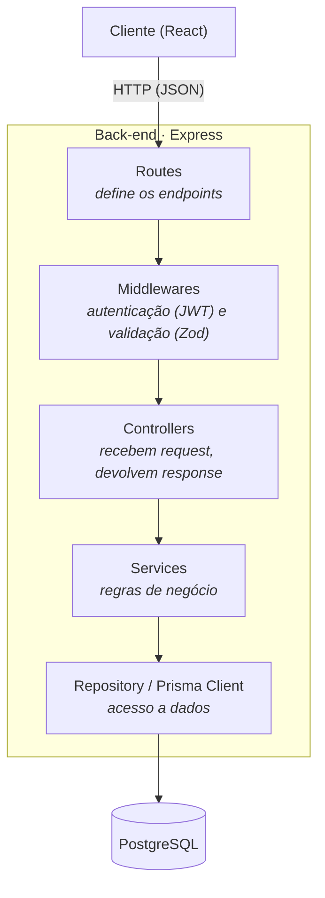
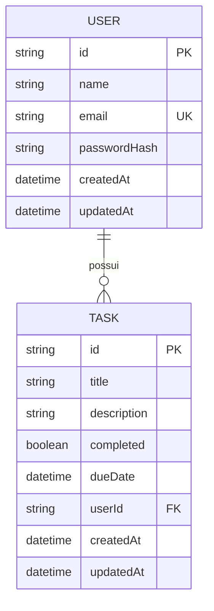

# 📝 Taskly


<!--  -->


Taskly e uma aplicação de gerenciamento de tarefas com autenticação de usuários, construída como projeto de estudo aprofundado em back-end, com foco em **Clean Code**, **SOLID** e **Programação Orientada a Objetos**.

> 🚧 Projeto em desenvolvimento ativo. Este README é atualizado conforme novas partes são construídas.

---

## 📚 Índice

- [Sobre o projeto](#-sobre-o-projeto)
- [Stack utilizada](#-stack-utilizada)
- [Arquitetura](#-arquitetura)
- [Modelagem do banco de dados](#-modelagem-do-banco-de-dados)
- [Como rodar o projeto localmente](#-como-rodar-o-projeto-localmente)
- [API e Endpoints](#-api-e-endpoints)
- [Segurança](#-segurança)
- [Estrutura de pastas](#-estrutura-de-pastas)
- [Roadmap](#-roadmap)
- [Convenções e Padrões](#-convenções-e-padrões)
- [Autor](#-autor)

---

## 📖 Sobre o projeto

Uma lista de tarefas (Taskly) onde cada usuário se cadastra, faz login e gerencia suas próprias tarefas com título, descrição, prazo e status de conclusão.

O objetivo principal deste projeto **não é só a funcionalidade em si**, mas o processo de construí-la seguindo boas práticas de arquitetura de back-end, separação de responsabilidades (routes → controllers → services → repository), tipagem forte com TypeScript, autenticação segura com hash de senha e JWT, e modelagem de dados relacional.

---

## 🛠 Stack utilizada

**Back-end**
- [Node.js](https://nodejs.org/) — ambiente de execução
- [Express](https://expressjs.com/) — framework do servidor HTTP
- [TypeScript](https://www.typescriptlang.org/) (ESM/`nodenext`) — tipagem estática
- [Prisma](https://www.prisma.io/) — ORM (mapeamento objeto-relacional)
- [PostgreSQL](https://www.postgresql.org/) — banco de dados relacional
- [Docker](https://www.docker.com/) — containerização do banco em ambiente local
- [bcrypt](https://www.npmjs.com/package/bcrypt) — hash de senhas
- [jsonwebtoken](https://www.npmjs.com/package/jsonwebtoken) — autenticação via JWT
- [Zod](https://zod.dev/) — validação de dados de entrada
- [Winston](https://github.com/winstonjs/winston) — logs estruturados
- [Jest](https://jestjs.io/) + [Supertest](https://www.npmjs.com/package/supertest) — testes automatizados

**Front-end** 
- [React](https://react.dev/)
- [Tailwind CSS](https://tailwindcss.com/)

---

## 🏗 Arquitetura

O back-end segue uma separação de camadas, onde cada uma tem uma única responsabilidade:



**Por que essa separação importa?** cada camada só conhece a camada logo abaixo dela. O `Controller` não sabe como o banco funciona, o `Service` não sabe se a requisição veio de uma rota HTTP ou de um teste automatizado, isso torna o código mais fácil de testar e de modificar sem quebrar outras partes.

---

## 🗃 Modelagem do banco de dados



Um `User` pode ter várias `Task`s (relação um-para-muitos) cada tarefa pertence a exatamente um usuário, garantido pela chave estrangeira `userId`, todas as consultas de tarefas são filtradas por `userId` na camada de serviço, garantindo que um usuário nunca acesse ou modifique tarefas de outro.

---

## 🚀 Como rodar o projeto localmente

### Pré-requisitos
- Node.js 20+
- Docker Desktop

### Passo a passo

```bash
# 1. Clone o repositório
git clone https://github.com/joseluucaas/taskly.git
cd todo-list-fullstack

# 2. Suba o banco de dados PostgreSQL
docker compose up -d

# 3. Configure as variáveis de ambiente do back-end
cd Backend
cp .env.example .env
# edite o .env com suas credenciais, se necessário

# 4. Instale as dependências
npm install

# 5. Rode as migrations do Prisma
npx prisma migrate dev

# 6. Suba o servidor em modo desenvolvimento
npm run dev
```

O servidor sobe por padrão em `http://localhost:3000`.

---

## 🔌 API e Endpoints

Todos os endpoints protegidos exigem o header `Authorization: Bearer <token>`.

### Autenticação

| Método | Endpoint | Descrição | Corpo da requisição | Resposta |
|--------|----------|-----------|----------------------|----------|
| POST | `/auth/register` | Cadastra um novo usuário | `{ "name", "email", "password" }` | `{ "id", "name", "email", "createdAt" }` |
| POST | `/auth/login` | Autentica e retorna um token JWT | `{ "email", "password" }` | `{ "token" }` |

### Tarefas 🔒

> Todas as rotas abaixo exigem autenticação e operam apenas sobre as tarefas do usuário logado.

| Método | Endpoint | Descrição | Corpo da requisição | Resposta |
|--------|----------|-----------|----------------------|----------|
| POST | `/tasks` | Cria uma nova tarefa | `{ "title", "description?", "dueDate?" }` | Tarefa criada (`201`) |
| GET | `/tasks` | Lista as tarefas do usuário logado | — | Array de tarefas (`200`) |
| GET | `/tasks/:id` | Busca uma tarefa específica | — | Tarefa (`200`) ou `404` |
| PUT | `/tasks/:id` | Atualiza uma tarefa | Campos a atualizar | Tarefa atualizada (`200`) ou `404` |
| DELETE | `/tasks/:id` | Remove uma tarefa | — | `204 No Content` ou `404` |

---

## 🔒 Segurança

- **Hash de senhas com bcrypt** (salt rounds : 10) a senha em texto puro nunca é armazenada
- **Mensagens de erro genéricas no login** a API responde a mesma mensagem tanto para email inexistente quanto para senha incorreta, evitando enumeração de usuários
- **Restrição de unicidade de email** a nível de banco de dados (`@unique` no schema)
- **Tokens JWT assinados** com segredo forte, armazenado em variável de ambiente (nunca no código-fonte)
- **Autorização por recurso (IDOR-safe)** toda operação sobre uma tarefa (buscar, atualizar, deletar) valida que ela pertence ao usuário autenticado antes de executar, prevenindo acesso indevido a dados de terceiros
- **Variáveis sensíveis fora do controle de versão** (`.env` no `.gitignore`, apenas `.env.example` é versionado)
- Middleware de autenticação (`authMiddleware`) protegendo todas as rotas privadas
- `helmet` configurado para headers de segurança HTTP *(planejado)*
- Rate limiting no endpoint de login, prevenindo força bruta *(planejado)*

---

## 📂 Estrutura de pastas

```
Taskly/
├── Backend/
│   ├── prisma/
│   │   ├── schema.prisma       # modelagem do banco (User, Task)
│   │   └── migrations/         # histórico de mudanças no banco
│   ├── src/
│   │   ├── config/              # configuração do Prisma Client (singleton)
│   │   ├── controllers/         # AuthController, TaskController
│   │   ├── services/            # AuthService, TaskService (regras de negócio)
│   │   ├── routes/              # auth.routes.ts, task.routes.ts
│   │   ├── middlewares/         # authMiddleware (proteção JWT)
│   │   ├── types/                # augmentation de tipos do Express (req.userId)
│   │   ├── generated/            # Prisma Client (gerado automaticamente)
│   │   ├── app.ts                # configuração do Express
│   │   └── server.ts             # inicialização do servidor
│   ├── prisma.config.ts
│   ├── tsconfig.json
│   └── package.json
├── FrontEnd/                   # React + Tailwind (em construção)
├── docker-compose.yml          # container do PostgreSQL
└── README.md
```

---

## 🗺 Roadmap

- [x] **Configuração do ambiente**
  - [x] TypeScript com ESM (`nodenext`)
  - [x] ESLint + Prettier
- [x] **Banco de dados**
  - [x] Prisma + PostgreSQL via Docker
  - [x] Modelagem do schema (`User`, `Task`)
  - [x] Migrations aplicadas
- [x] **Servidor**
  - [x] Express configurado
  - [x] Rota de health check
- [x] **Autenticação**
  - [x] Cadastro de usuário (hash de senha com bcrypt)
  - [x] Login com geração de token JWT
  - [x] Middleware de proteção de rotas
- [x] **CRUD de tarefas**
  - [x] Criar tarefa
  - [x] Listar tarefas do usuário
  - [x] Buscar tarefa por ID
  - [x] Atualizar tarefa
  - [x] Excluir tarefa
- [X] **Tratamento de erros e validação**
  - [X] Error handler centralizado (middleware do Express)
  - [X] Validação de entrada com Zod em todas as rotas
- [X] **Testes automatizados**
  - [X] Testes de autenticação
  - [X] Testes de CRUD de tarefas
- [ ] **Front-end**
  - [ ] Setup React + Tailwind
  - [ ] Telas de login/cadastro
  - [ ] Dashboard de tarefas
- [ ] **Deploy**
  - [ ] Back-end
  - [ ] Front-end

---

## 📐 Convenções e padrões

### Arquitetura em camadas

O projeto segue estritamente `routes → middlewares → controllers → services → repository (Prisma)`, sem misturar responsabilidades entre camadas (ver [Arquitetura](#-arquitetura)).

### Commits

Este projeto segue a convenção [Conventional Commits](https://www.conventionalcommits.org/pt-br/v1.0.0/) facilitando a leitura do histórico e a identificação do tipo de cada mudança.

| Prefixo | Uso |
|---------|-----|
| `feat:` | Nova funcionalidade |
| `fix:` | Correção de bug |
| `refactor:` | Reorganização de código sem mudar comportamento |
| `docs:` | Mudanças na documentação |
| `chore:` | Configuração, tarefas de manutenção |
| `test:` | Adição ou ajuste de testes |

---

## 👤 Autor

**Jose Lucas**
Desenvolvedor Full-Stack
